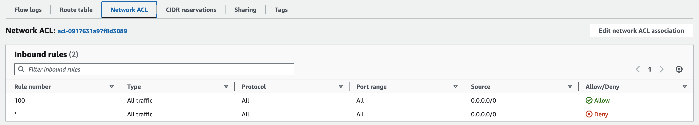
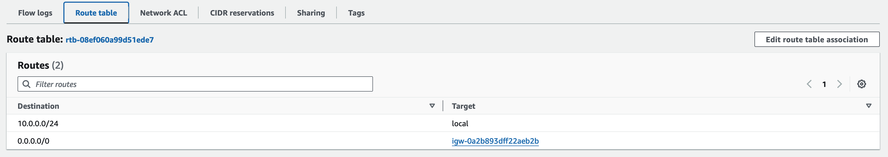

# Goal of this project

The goal of this project is to have a simple, empty, service that can be deployed on AWS ECS. 

### Important notes
This documentation is based on creating a *public subnet* and having ECS services widely exposed on the Internet. 

### Overview
There are a few core components that are used in this architecture:
 * ECR to store container images
 * ECS to host the service
 * Standard components that are mandatory for this to work and need to be configured:
    * VPC
    * Subnet configured to be *public*
    * Security Groups to allow for public access to the Service on `TCP:8080`

## How to
### 1. Building the container image and deploying it to ECR
The following steps are needed: 
 * **Create the Github Actions YAML**. A working example is found under `.github/workflows/release-dev.yml`. 
 * **Create an ECR repo**. A repo needs to be created on ECR before being able to push to it. 

To **create an ECR Repo**: 
 * Go on AWS portal, in ECR, Private Repositories and **Create a Repository**. 
 * Give a name to the repo, and you're done!

### 2. Create an ECS cluster
To do that you need to: 

#### 2.1. Creating the Networking components
Creating a VPC is straightforward. The most important aspect is **choosing the CIDR block size** that will determine the *number of IP addresses available in that VPC*. 

Create a Subnet that will host the VPC cluster.  
Here too, choose the CIDR block size.

After creating VPC and Subnet, you need to attach an Internet Gateway and update the Subnet's route table to make it *public*. See [below for instructions](#22-attach-an-internet-gateway-to-the-vpc). 

Make sure that the **Network ACL** contains a row that allows for traffic on all protocols, ranges and addresses, like shown in the image below. 

That's it!

#### 2.2. Attach an Internet Gateway to the VPC
Important: An Internet Gateway is **attached to the VPC**. An IGW allows **bidirectional** internet connectivity. 

The goal here is to make the created **subnet connected to Internet**. 

 * Create an IGW
 * Attach the IGW to the VPC
 * Go in the **route table** of the **subnet** and add a route with a destination of 0.0.0.0/0 for IPv4 traffic or ::/0 for IPv6 traffic, and a target of the internet gateway ID (igw-xxxxxxxxxxxxxxxxx).  
 To do that: 
    * Go on the *subnet*
    * Click on the *route table*
    * Click on *edit routes*
    * Add the route to the IGW

> At this point you should see something like this: 

For more information and references of what documentation I used: 
 * [How Amazon VPC Works - Ip Addressing](https://docs.aws.amazon.com/vpc/latest/userguide/how-it-works.html#vpc-ip-addressing)
 * [Description of an IGW](https://docs.aws.amazon.com/vpc/latest/userguide/VPC_Internet_Gateway.html)
 * [Making a subnet a public subnet by routing to an IGW](https://docs.aws.amazon.com/vpc/latest/userguide/route-table-options.html#route-tables-internet-gateway)

#### 2.3. Create an ECS Cluster
Creating a ECS Cluster is easy: make sure to select **Fargate** as infrastructure (serverless).

#### 2.4. Create a Task Definition
The *Task Definition* can be created once and then reused.  
In the task definition you specify required CPU, Memory amd the **container specs**

#### 2.5. Create a Service
When creating an ECS Service, make sure that: 
 * To use **Capacity provider strategy**, making sure that the Capacity provider is FARGATE.
 * The Deployment Configuration > Application type is a **Service** (not a Task)
 * You select the correct *Task Definition*
 * You select the number of replicas
 * **IMPORTANT**: Under **Networking** you need to select **the right VPC** (not the default one), the **right subnet** (not the default one) and **the right Security Group**.  
 The Security Group must have a rule to **allow inbout TCP traffic on the right port**. 

When the service is deployed, it should have the task running. 